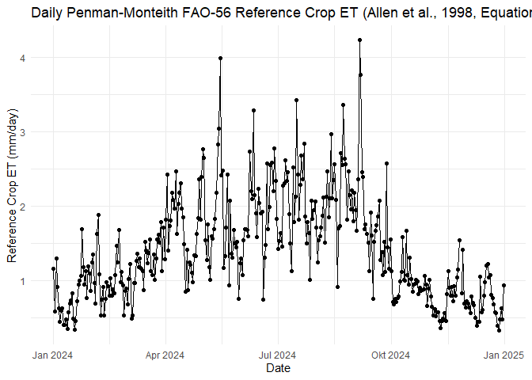

use case 1 - AMMS Station in Coswig
================

<!-- README.md is generated from README.Rmd. Please edit that file -->

# 1 Introduction

This use case shows the possibility to calculate evapotranspiration (ET)
for a specific weather station available on OpenSensorWeb. It implements
the Penman-Monteith formulation as realized in Evapotranspiration
Package in R (including the method for FAO-56 hypothetical short grass
and the method for ASCE-EWRI Standardised crop) for estimating reference
crop evapotranspiration
(<https://search.r-project.org/CRAN/refmans/Evapotranspiration/html/ET.PenmanMonteith.html>).
An alternative to calculate ET would be calculations using Big Leaf
Package: <https://cran.r-project.org/web/packages/bigleaf/bigleaf.pdf>
To adapt the calculations to a specific

# 2 Install and load package

``` r
library(opensensorwebr)

#install.packages("Evapotranspiration")
library(Evapotranspiration) # calculate evapotranspiration
library(lubridate) # lubridate for date transformations
library(tidyverse) # tidyverse for tidy data wrangling

library(ggplot2) # ploting data
library(plotly) # interactive plots (optional)
```

# 3 Get a dataset to calculate evaportranspiration according to Penman Monteight - Weather station of “Agrarmeteorologisches Messnetz Sachsen (AMMS)” in Coswig”

## 3.1 Description of the Station

- The Station ist situated in Coswig and maintained by
  Agrarmeteorologisches Messnetz Sachsen (AMMS).

- Measurment url is similar to:
  “<https://api.sensoto.io/v1/organizations/open/networks/AMMS_WETTERDATEN/devices/S021/sensors/Luftfeuchtigkeit_200cm/measurements>”

- Data Source (copied from <https://www.opensensorweb.de>)

  - source_shortname:“Agrarmeteorologisches Messnetz Sachsen (AMMS) -
    Wetterdaten”,
  - citation_statement:“Data provided by: Sächsisches Landesamt für
    Umwelt, Landwirtschaft und Geologie.
  - Legal information:
    <https://www.umwelt.sachsen.de/umwelt/download/Nutzungshinweis_2012.pdf>”
  - source_link_uri:“<https://www.landwirtschaft.sachsen.de/Wetter09/>”

- additional information
  (<https://api.sensoto.io/v1/organizations/open/networks/AMMS_WETTERDATEN/devices/S021/>)

  - Koordinates: 13.5363186, 51.1386678
  - Timezone: timezone “Europe/Berlin” (but data time stamp is given in
    UTC-timestamp if request is in UTC-format used in this package)

``` r
coswig <- opensensorwebr::etmodeldata("https://api.sensoto.io/v1/organizations/open/networks/AMMS_WETTERDATEN",
                                      my.device = "S021",
                                      my.startdate = "2024-01-01T00:00:00Z",
                                      my.interval = 8760,
                                      ID.GlobRad = "Globalstrahlg_200cm",
                                      ID.AirTemp = "Lufttemp_200cm",
                                      ID.RH = "Luftfeuchtigkeit_200cm",
                                      ID.Rain = "Niederschlag",
                                      ID.Wind = "Windgeschw_250cm",
                                      file = "temp/Wetter_Coswig_",
                                      write.RData = FALSE,
                                      write.csv = FALSE)
```

## 3.2 Calculate Penman Monteight grass reference evaporation based on OpenSensorWeb-Data

- The Package Evapotranspiration is developed by Danlu Guo and Seth
  Westra (Year First Available: 2014, E-mail:
  <Danlu.guo@adelaide.edu.au>, Website:
  <http://cran.r-project.org/web/packages/Evapotranspiration/index.html>)

``` r
# preprocess data for the package
coswig_preprocessed <- coswig %>%
  mutate(Year  = lubridate::year(date),
         Month =lubridate::month(date),
         Day   = lubridate::day(date),
         Hour = lubridate::hour(date)) %>%
  rename(RH = rh, # relative humidity in %
         Temp = Tmit, # Temperature in °C
         u2 = wind2m, # wind speed at 2m height, todo: recalculate windspeed from 2.5m to 2m
         Precip = nied) %>%
  mutate(Rs = 0.0036 * glob) %>% # solar radiation in MJ/m2 (Values are given as hourly W/m2, 1Ws = 1J --> 1Wh = 3600J = 0.0036 MJ)
  dplyr::select(Year, Month, Day, Hour, Temp, RH, u2, Rs, Precip)


# transform raw-data to ET-Package readable
coswig_processed <- Evapotranspiration::ReadInputs(varnames = c("Temp","RH","u2","Rs","Precip"),
                   coswig_preprocessed, 
                   constants, 
                   stopmissing=c(10,10,3),
                   timestep = "subdaily",
                   interp_missing_days = FALSE, 
                   interp_missing_entries = FALSE, 
                   interp_abnormal = FALSE, 
                   missing_method = NULL, 
                   abnormal_method = NULL)

# Call ET.PenmanMonteith under the generic function ET
data(constants) # use default constants --> probably change 2m measurement to 2.5m windmeasurment height

# set constants specific to Coswig-Messurement station
constants$z <- 2.5 # height of the wind measurement
constants$lat <- 51.13 # latitude of the station in Coswig: 13.5363186, 51.1386678
constants$lat_rad <- constants$lat * pi / 180 # the ET.Penman-Monteith-Formulation in Evaporation-Package needs the latitude in lat_rad
constants$Elev <- 118 # average ground elevaiton about sea level for Leipzig 

results <- ET.PenmanMonteith(coswig_processed, constants, ts="daily", solar="data",
wind="yes", crop = "short", message="yes", AdditionalStats="no", save.csv="no")
```

## 3.3 Plot daily ET for the station

``` r
coswig.et <- as.data.frame(results$ET.Daily)
coswig.et$date <- as.Date(row.names(coswig.et))
names(coswig.et) <- c("ET", "date")
rownames(coswig.et) <- NULL
coswig.et <- coswig.et %>%
  dplyr::select(date, ET)

# Einfacher Zeitreihenplot
p1 <- ggplot(coswig.et, aes(x = as.Date(date), y = ET)) +
  geom_line() +  # Linie verbinden
  geom_point() + # Punkte für die Werte
  labs(
    title = "Daily Penman-Monteith FAO-56 Reference Crop ET (Allen et al., 1998, Equation 6)",
    x = "Date",
    y = "Reference Crop ET (mm/day)"
  ) +
  theme_minimal()  # Minimalistisches Design

p1
```

<!-- -->

Optional plot an interactive plot in plotly (not for md-output)

``` r
ggplotly(p1)
```

## 3.4 Export results to file

``` r
save(coswig.et, file = "temp/coswig_et.RData")
```
