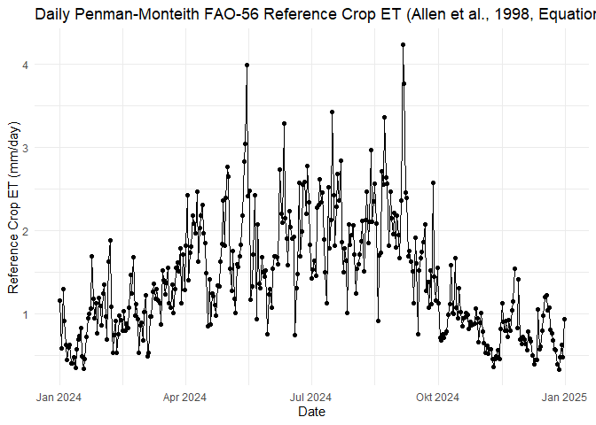

use case 2 - LfULG-Station in Leipzig
================

<!-- README.md is generated from README.Rmd. Please edit that file -->

# 1 Introduction

This use case shows the possibility to calculate evapotranspiration (ET)
for a specific weather station available on OpenSensorWeb. It implements
the Penman-Monteith formulation as realized in Evapotranspiration
Package in R (including the method for FAO-56 hypothetical short grass
and the method for ASCE-EWRI Standardised crop) for estimating reference
crop evapotranspiration
(<https://search.r-project.org/CRAN/refmans/Evapotranspiration/html/ET.PenmanMonteith.html>).
An alternative to calculate ET would be calculations using Big Leaf
Package: <https://cran.r-project.org/web/packages/bigleaf/bigleaf.pdf>
To adapt the calculations to a specific

# 2 Install and load package

``` r
library(opensensorwebr)

#install.packages("Evapotranspiration")
library(Evapotranspiration) # calculate evapotranspiration
library(lubridate) # lubridate for date transformations
library(tidyverse) # tidyverse for tidy data wrangling

library(ggplot2) # ploting data
library(plotly) # interactive plots (optional)
```

# 3 Get a dataset to calculate evaportranspiration according to Penman Monteight - For another station

  - Todo: insert functionality to transform wind speed measured in 2.5m
    into 2m

<!-- end list -->

``` r
# an LFULG Station in Leipzig

## List Available Sensors
opensensorwebr::availablesensors("https://api.opensensorweb.de/v1/organizations/pikobytes/networks/LUFTGUETE_LFULG", my.device = "DESN025")

leipzig <- opensensorwebr::etmodeldata("https://api.opensensorweb.de/v1/organizations/pikobytes/networks/LUFTGUETE_LFULG",
                                      my.device = "DESN025",
                                      my.startdate = "2024-01-01T00:00:00Z",
                                      my.interval = 8760,
                                      ID.GlobRad = "STRAHL",
                                      ID.AirTemp = "TEMP",
                                      ID.RH = "FEUCHT",
                                      ID.Rain = "BEN", # Todo: there is no Rain at this station  --> find generic way to set values NA and fill with other station
                                      ID.Wind = "WINDGE",
                                      file = "temp/Wetter_Leipzig_",
                                      write.RData = FALSE,
                                      write.csv = FALSE)
```

## 3.1 Calculate Penman Monteight grass reference evaporation based on OpenSensorWeb-Data

escription: Package Evapotranspiration Developers: Danlu Guo, Seth
Westra Year First Available: 2014 E-mail: <Danlu.guo@adelaide.edu.au>
Website:
<http://cran.r-project.org/web/packages/Evapotranspiration/index.html>
<file:///C:/Users/rgrass/Downloads/EVOPOTRANSPIRATION-1.pdf>

``` r
# preprocess data for the package
leipzig_preprocessed <- leipzig %>%
  mutate(Year  = lubridate::year(date),
         Month =lubridate::month(date),
         Day   = lubridate::day(date),
         Hour = lubridate::hour(date)) %>%
  rename(RH = rh, # relative humidity in %
         Temp = Tmit, # Temperature in °C
         u2 = wind2m) %>% # wind speed at 2m height, todo: recalculate windspeed from 2.5m to 2m
  mutate(Rs = 0.0036 * glob) %>% # solar radiation in MJ/m2 (Values are given as hourly W/m2, 1Ws = 1J --> 1Wh = 3600J = 0.0036 MJ)
  dplyr::select(Year, Month, Day, Hour, Temp, RH, u2, Rs)

# transform raw-data to ET-Package readable
leipzig_processed <- Evapotranspiration::ReadInputs(varnames = c("Temp","RH","u2","Rs"),
                   leipzig_preprocessed, 
                   constants, 
                   stopmissing=c(10,10,3),
                   timestep = "subdaily",
                   interp_missing_days = FALSE, 
                   interp_missing_entries = FALSE, 
                   interp_abnormal = FALSE, 
                   missing_method = NULL, 
                   abnormal_method = NULL)


# Call ET.PenmanMonteith under the generic function ET
data(constants) # use default constants --> probably change 2m measurement to 2.5m windmeasurment height

# set constants specific to Leipzig-Messurement station
constants$z <- 2.5 # height of the wind measurement
constants$lat <- 51.36 # latitude of Kasseler Strasse in Leipzig
constants$lat_rad <- constants$lat * pi / 180 # the ET.Penman-Monteith-Formulation in Evaporation-Package needs the latitude in lat_rad
constants$Elev <- 113 # average ground elevaiton about sea level for Leipzig 

results <- ET.PenmanMonteith(leipzig_processed, constants, ts="daily", solar="data",
wind="yes", crop = "short", message="yes", AdditionalStats="no", save.csv="no")
```

## 3.2 Plot daily ET for the station

``` r
leipzig.et <- as.data.frame(results$ET.Daily)
leipzig.et$date <- as.Date(row.names(leipzig.et))
names(leipzig.et) <- c("ET", "date")
rownames(leipzig.et) <- NULL
leipzig.et <- leipzig.et %>%
  dplyr::select(date, ET)

# Einfacher Zeitreihenplot
p1 <- ggplot(leipzig.et, aes(x = as.Date(date), y = ET)) +
  geom_line() +  # Linie verbinden
  geom_point() + # Punkte für die Werte
  labs(
    title = "Daily Penman-Monteith FAO-56 Reference Crop ET (Allen et al., 1998, Equation 6)",
    x = "Date",
    y = "Reference Crop ET (mm/day)"
  ) +
  theme_minimal()  # Minimalistisches Design

p1
```

<!-- -->

Optional plot an interactive plot in plotly (not for md-output)

``` r
ggplotly(p1)
```

## 3.3 Export results to file

``` r
save(leipzig.et, file = "temp/leipzig_et.RData")
```
